# 知识库管理平台标准 AI 项目架构设计说明书

文档版本：v3.1（阿里云环境与 Milvus 基线）

日期：2026-09-14

状态：当前唯一架构基线

需求基线：《01_知识库管理平台_需求规格说明书.md》v1.1

## 1. 设计声明

本版本只调整系统架构，不删除、缩小或替换任何已确认业务功能。保留多租户、单直属部门、部门权限覆盖下级、四维 OR 鉴权、五类文档、MinerU、硅基流动三个模型、魔搭 MCP、三路问答、FAQ 审核缓存、知识缺口、运营看板、云部署和 7 日业务日志。

本版本采用标准 AI 应用分层，并在确有状态编排、模型决策、并行分支或人工介入的业务中使用 LangGraph 与多 Agent：

- 文档导入与分析：使用 `DocumentIngestionGraph`。
- 在线问答：使用 `KnowledgeAnswerGraph`，内部由多个专职 Agent 并行协作。
- FAQ 挖掘与人工审核：使用 `FaqEvolutionGraph`。
- 知识缺口诊断与补全复验：使用 `KnowledgeGapGraph`。
- 人员变动和权限转移：使用确定性 Saga/工作流，不使用 LLM。
- 权限判定、租户隔离、状态转换、审批发布、数据库写入、统计计算：使用确定性代码，不交给 Agent。

LangGraph 负责“编排什么步骤、何时分支、何时等待、如何恢复”；Agent Harness 负责“每个 Agent 如何安全运行、能调用哪些工具、使用哪个模型、消耗多少预算、如何记录轨迹”；Celery/队列负责“把长任务可靠地调度到 worker 并重试”。三者职责不能混在一个大文件中。

## 2. 架构目标

1. 从真实用户操作走到持久化可见结果，覆盖前端、API、领域规则、Graph、Provider、存储和审计。
2. 任何 Agent 都无法绕过 tenant、RBAC 和 ACL；未授权正文不进入 Prompt、MCP 或模型日志。
3. 每个 Graph 有独立 State、Nodes、Edges、Checkpointer、输入输出 Schema 和测试。
4. 每个 Agent 有独立职责、Prompt、Tool allowlist、输入输出 Schema、预算和失败策略。
5. 文档导入不仅提取文本，还完成 LLM 文档结构分析、分类、元数据建议、切片策略选择和质量判断。
6. 三路检索保留各自证据和失败状态，最终答案可解释、可引用、可审计。
7. 代码按业务域和分层目录组织，禁止把 router、ORM、Prompt、Agent、Provider 和任务实现堆在同一文件。

## 3. 标准 AI 项目分层

```text
┌──────────────────────────────────────────────────────────────┐
│ Presentation：Vue 管理端、AI 工作台、SSE、可视化进度         │
├──────────────────────────────────────────────────────────────┤
│ API/BFF：FastAPI、认证、租户上下文、请求校验、幂等、限流      │
├──────────────────────────────────────────────────────────────┤
│ Application：用例服务、事务、领域协调、Outbox、任务提交        │
├──────────────────────────────────────────────────────────────┤
│ AI Orchestration：LangGraph 主图/子图、State、Node、Route      │
├──────────────────────────────────────────────────────────────┤
│ Agent Harness：AgentRunner、Prompt、Tool、Policy、Budget、Trace │
├──────────────────────────────────────────────────────────────┤
│ Domain：Tenant、Organization、ACL、Knowledge、FAQ、Gap、Audit  │
├──────────────────────────────────────────────────────────────┤
│ AI Capabilities：RAG、MinerU、MCP、Chat、Embedding、Rerank     │
├──────────────────────────────────────────────────────────────┤
│ Infrastructure：PostgreSQL、Milvus、Redis、对象存储、Celery   │
├──────────────────────────────────────────────────────────────┤
│ AI Quality：Prompt Registry、Datasets、Evals、Tracing、Guard   │
└──────────────────────────────────────────────────────────────┘
```

依赖方向由外向内：API 调用应用用例，应用用例调用领域和 Graph；Graph 通过端口调用 Harness/Tool/Provider；基础设施实现端口。领域层不导入 FastAPI、LangGraph、Celery 或供应商 SDK。

## 4. 系统上下文与运行组件

```text
用户浏览器
  │ HTTPS/SSE
  ▼
Web/BFF/API ── Auth/Tenant/RBAC/ACL ── PostgreSQL
  │                    │                    │
  │                    └── Redis Cache      └── Outbox/Checkpoint
  │                                           │
  │                                      Milvus 向量数据面
  │
  ├── 同步短图：KnowledgeAnswerGraph Runtime
  └── 异步任务：Celery Queue
                    │
                    ├── DocumentIngestionGraph Worker
                    ├── FaqEvolutionGraph Worker
                    ├── KnowledgeGapGraph Worker
                    └── Analytics/Retention Worker
                              │
             ┌────────────────┼──────────────────┐
             ▼                ▼                  ▼
        MinerU API      SiliconFlow Gateway   MCP Gateway
                         Chat/Embed/Rerank     ModelScope API
             │                │                  │
             └────────────────┴──────────────────┘
                              │
                    Agent Trace / Metrics / Evals
```

首期可以部署为一个代码仓库中的多个进程角色：`api`、`agent-runtime`、`worker-ingestion`、`worker-aiops`、`scheduler`。逻辑边界先稳定，再依据负载拆成独立服务；不能把所有模块写进一个应用文件。

### 4.1 系统上下文图

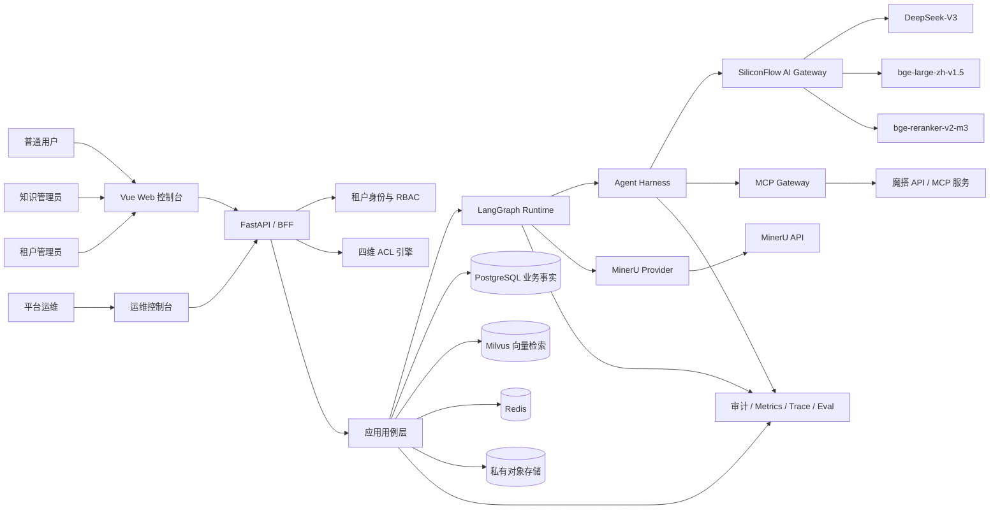

浏览器永远不直接访问数据库、对象存储、模型、MinerU 或 MCP。所有调用先进入 API 获取可信 tenant/user 上下文，再经过应用层和 Graph。对象存储下载也由 API 重新鉴权后生成短时地址。

### 4.2 总体业务闭环图

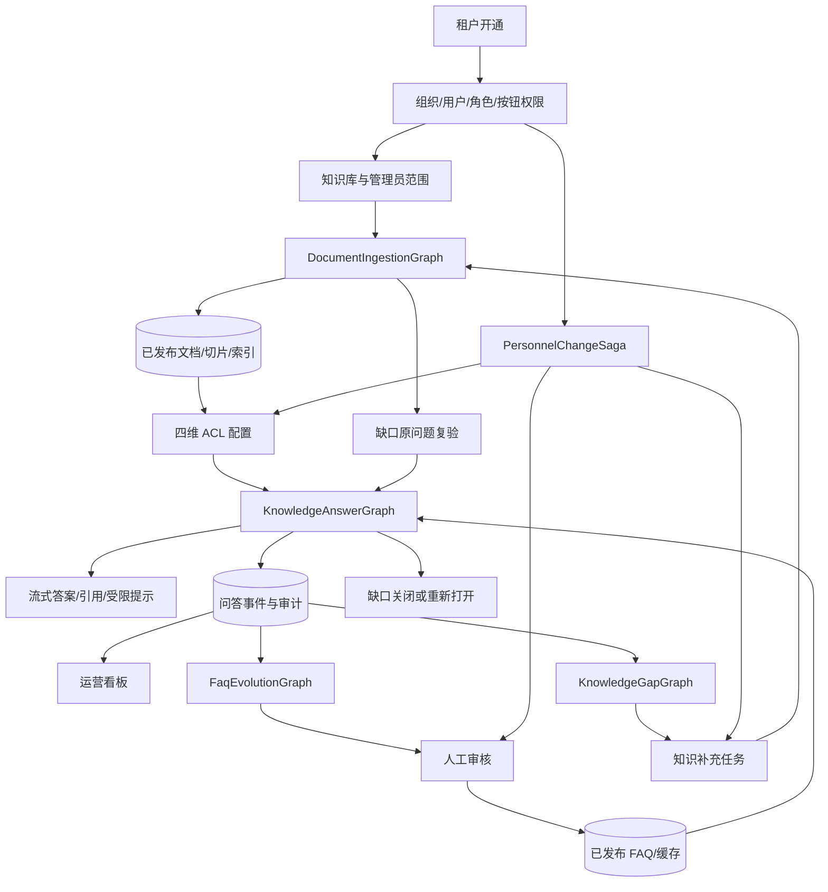

这张图表示四个 Graph 不是孤立系统：文档图向问答图提供当前版本知识；问答事件向 FAQ 图和缺口图供数；缺口图再次调用文档图和问答图完成复验；人员变动工作流会触发权限缓存失效、管理职责和审核任务转移。

### 4.3 Graph 之间的触发、产物和消费关系

| 工作流 | 触发来源 | 关键输入 | 持久化产物 | 下游消费者 |
|---|---|---|---|---|
| DocumentIngestionGraph | 上传、切片编辑、缺口补充任务 | 文件、kb、租户、默认空 ACL | 文档版本、解析产物、chunks、vectors、索引 | AnswerGraph、FAQ 来源、看板 |
| KnowledgeAnswerGraph | 用户提问、缺口复验 | 当前身份、会话、问题、模式 | 消息、证据、引用、usage、审计事件 | 用户、FAQGraph、GapGraph、看板 |
| FaqEvolutionGraph | 每日调度、管理员手动运行 | 最近 7 日合格问答事件 | 聚类、候选、审核记录、FAQ、缓存 | AnswerGraph、看板 |
| KnowledgeGapGraph | no_match/low_relevance/insufficient/conflict | 问题、身份快照、检索诊断 | 缺口、补充任务、replay 结果 | IngestionGraph、AnswerGraph、管理员 |
| PersonnelChangeSaga | 离职或调岗操作 | 旧/新人员、部门、处置决定 | 会话撤销、职责转移、ACL 处置审计 | ACL、FAQ 审核、缺口任务、缓存 |
| Analytics/Retention | 事件流和定时器 | request/job/model/tool 事件 | 聚合指标、7 日清理结果 | 看板、运营和审计人员 |

### 4.4 一次完整业务生命周期时序

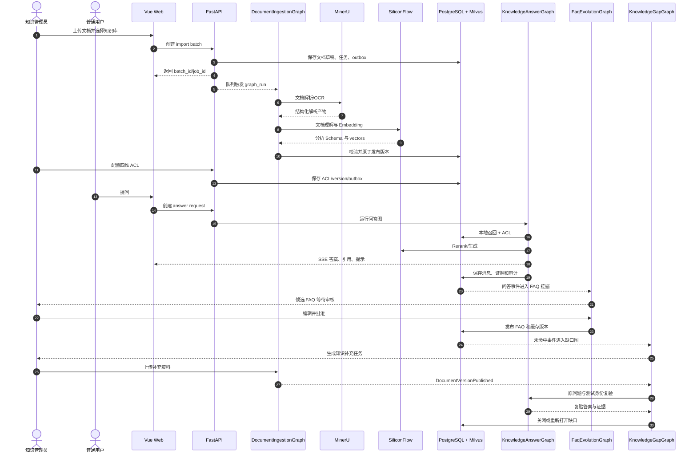

### 4.5 事件驱动关系图

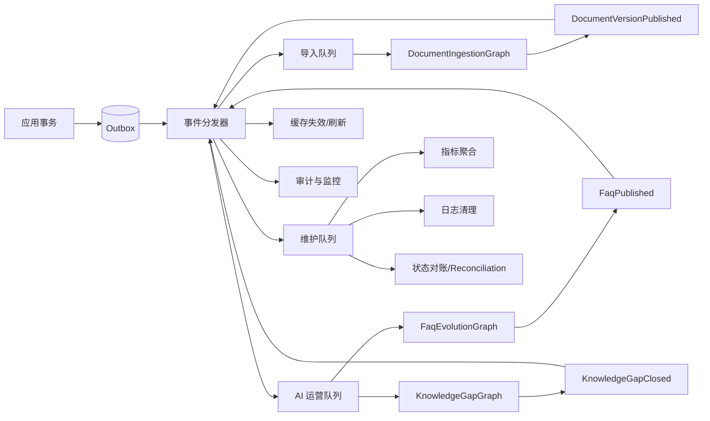

业务数据和 outbox 在同一个数据库事务中提交，避免“页面显示成功但异步任务没有收到”。消费者以 event_id 去重；事件只带 ID、版本和必要元数据，不携带大段敏感正文。

## 5. 技术选型

| 能力 | 技术 | 用途 |
|---|---|---|
| 前端 | Vue 3、TypeScript、Vite、Pinia、Element Plus、ECharts | 管理控制台、聊天、图表和任务进度 |
| API | FastAPI、Pydantic v2 | REST、SSE、Schema 验证和认证中间件 |
| 领域/持久化 | SQLAlchemy 2、Alembic、PostgreSQL 16 | 事务、迁移、RLS 和业务事实 |
| 向量检索 | Milvus | 独立向量数据面，保存 chunk 向量及检索所需标量字段；PostgreSQL 保持事实源 |
| 图编排 | LangGraph | 文档、问答、FAQ 和缺口状态图 |
| Agent 运行 | 自有 Agent Harness + LangChain Core 接口 | Agent 定义、模型/工具、预算、策略、追踪 |
| 异步执行 | Celery + Redis | 长 Graph 执行、定时任务、重试和队列隔离 |
| Graph Checkpoint | PostgreSQL Checkpoint Adapter | 断点恢复、人工审核等待和状态审计 |
| 对象存储 | 云对象存储/S3 兼容接口 | 原文件、解析产物、导出和证据包 |
| 文档解析 | MinerU API Adapter | PDF、DOC/DOCX、表格和 OCR 解析 |
| Chat | SiliconFlow `deepseek-ai/DeepSeek-V3` | 文档理解、查询规划、答案生成、FAQ 辅助 |
| Embedding | SiliconFlow `BAAI/bge-large-zh-v1.5` | 文档、问题、FAQ 和聚类向量 |
| Rerank | SiliconFlow `Pro/BAAI/bge-reranker-v2-m3` | 授权候选精排 |
| MCP | MCP Client + ModelScope API Wrapper | 受控外部知识/工具调用 |
| AI 可观测性 | OpenTelemetry + 结构化 AI Trace | Graph/Agent/Tool/Model 链路 |
| 测试 | pytest、Testcontainers、Playwright、离线 Eval Runner | 单元、集成、E2E 和 AI 评测 |

具体 Python 包版本在实施时锁定。文档不假设尚未验证的 MinerU、硅基流动或魔搭接口形态。

## 6. 仓库与模块目录

```text
knowledge-platform/
├─ apps/
│  ├─ web/                              # Vue 前端
│  │  └─ src/
│  │     ├─ pages/{auth,organization,knowledge,chat,faq,gaps,analytics}
│  │     ├─ features/{acl-selector,upload-center,source-viewer,stream-chat}
│  │     ├─ entities/{user,department,document,conversation,faq,gap}
│  │     ├─ shared/{api,auth,ui,charts,utils}
│  │     └─ router/
│  ├─ api/                              # FastAPI 入口和 BFF
│  │  └─ src/{routers,dependencies,middleware,schemas,exception_handlers}
│  ├─ agent_runtime/                    # LangGraph 在线运行入口
│  │  └─ src/{graph_api,streaming,checkpointing,lifecycle}
│  └─ workers/                          # Celery 进程入口
│     └─ src/{ingestion_tasks,aiops_tasks,analytics_tasks,reconciliation}
├─ packages/
│  ├─ domain/                           # 纯领域模型与规则
│  │  └─ src/
│  │     ├─ tenants/
│  │     ├─ organization/
│  │     ├─ identity/
│  │     ├─ authorization/
│  │     ├─ knowledge/
│  │     ├─ conversations/
│  │     ├─ faq/
│  │     ├─ gaps/
│  │     └─ audit/
│  ├─ application/                      # 用例与事务边界
│  │  └─ src/use_cases/{tenant,organization,knowledge,answering,faq,gaps}
│  ├─ agent_harness/
│  │  └─ src/
│  │     ├─ definitions/                # AgentDefinition
│  │     ├─ runner/                     # 统一执行器
│  │     ├─ policies/                   # 权限、出网、预算、内容策略
│  │     ├─ prompts/                    # Prompt 模板与版本
│  │     ├─ schemas/                    # Agent 输入/输出 Pydantic 模型
│  │     ├─ tools/                      # ToolRegistry 和安全包装
│  │     ├─ memory/                     # 对话/工作记忆端口
│  │     ├─ tracing/                    # Agent/Tool/Model trace
│  │     └─ budgets/                    # token、耗时、工具次数
│  ├─ graphs/
│  │  └─ src/
│  │     ├─ common/{context,events,errors,routing,checkpoint}
│  │     ├─ document_ingestion/
│  │     │  ├─ graph.py
│  │     │  ├─ state.py
│  │     │  ├─ routes.py
│  │     │  ├─ nodes/{validate,convert,mineru_parse,analyze,chunk,quality,embed,index,publish}.py
│  │     │  ├─ agents/{document_analyzer,metadata_extractor,chunk_strategy,quality_reviewer}.py
│  │     │  └─ schemas/{input,analysis,quality,output}.py
│  │     ├─ knowledge_answer/
│  │     │  ├─ graph.py
│  │     │  ├─ state.py
│  │     │  ├─ routes.py
│  │     │  ├─ nodes/{prepare,faq_lookup,fanout,local,mcp,general,fuse,generate,verify,persist}.py
│  │     │  ├─ agents/{query_planner,local_retrieval,mcp_research,general_knowledge,evidence_fusion,answer_writer}.py
│  │     │  └─ schemas/{request,evidence,claim,answer}.py
│  │     ├─ faq_evolution/
│  │     │  ├─ graph.py
│  │     │  ├─ state.py
│  │     │  ├─ nodes/{load,cluster,analyze,draft,submit,human_review,publish,cache}.py
│  │     │  └─ agents/{cluster_analyst,faq_drafter}.py
│  │     └─ knowledge_gap/
│  │        ├─ graph.py
│  │        ├─ state.py
│  │        ├─ nodes/{collect,diagnose,aggregate,suggest,assign,replay,close}.py
│  │        └─ agents/{gap_diagnoser,task_suggester}.py
│  ├─ retrieval/
│  │  └─ src/{keyword,vector,rrf,rerank,acl_filter,context_builder}
│  ├─ providers/
│  │  └─ src/{siliconflow,mineru,modelscope,storage,secrets}
│  ├─ mcp_gateway/
│  │  └─ src/{client,registry,router,policy,normalizer,servers/modelscope_wrapper}
│  ├─ persistence/
│  │  └─ src/{postgres,repositories,models,rls,outbox,checkpoints,cache}
│  ├─ vector_store/
│  │  └─ src/{milvus_client,collections,indexes,repository,synchronizer,reconciler}
│  ├─ observability/
│  │  └─ src/{logging,metrics,tracing,usage,audit_events}
│  └─ evaluation/
│     └─ src/{datasets,retrieval_eval,answer_eval,security_eval,regression}
├─ migrations/
├─ tests/
│  ├─ unit/{domain,harness,graphs,retrieval}
│  ├─ integration/{db,providers,mcp,checkpoints,queues}
│  ├─ security/{tenant,acl,prompt_injection,tool_injection}
│  ├─ evals/{retrieval,answers,faq,gaps}
│  └─ e2e/{ingestion,chat,permissions,faq,gaps,analytics}
├─ data/demo/{tenant-a,tenant-b,documents,evalsets}
├─ deploy/{docker,cloud,monitoring}
├─ docs/{requirements,architecture,adr,operations,security}
└─ evidence/{architecture,test-reports,provider-smoke,screenshots}
```

文件职责约束：单个 node 只完成一个状态变化；Prompt 不写在 node 中；Provider SDK 不从业务域直接调用；ORM model 不当作 API Schema；Graph state 不当作数据库实体；工具实现不混入 Agent 定义。

## 7. Agent Harness 设计

Agent Harness 是所有 Agent 的统一运行底座，防止每个 Agent 自己拼模型请求、工具调用和日志。

### 7.1 核心对象

| 对象 | 职责 |
|---|---|
| AgentDefinition | name、version、system_prompt_ref、input/output schema、model policy、tool allowlist |
| AgentRunner | 组装上下文、调用模型、验证输出、限制修复次数、返回标准结果 |
| ExecutionContext | request/job、tenant、user、角色、部门、authz_version、trace、deadline |
| ModelRouter | 将任务映射到指定硅基流动模型和参数，区分 mock/live |
| ToolRegistry | 注册本地检索、MCP、元数据读取等工具及 JSON Schema |
| PolicyEngine | tenant、ACL、数据外发、敏感级别、Prompt/Tool 策略检查 |
| BudgetManager | token、模型调用数、MCP 次数、总耗时和租户费用上限 |
| PromptRegistry | Prompt 内容、版本、适用 Agent、变更记录和回滚 |
| SchemaValidator | Pydantic 严格输出校验，最多有限次数修复 |
| TraceRecorder | Graph/Node/Agent/Tool/Model 的输入摘要、输出摘要、耗时、usage、错误 |
| MemoryAdapter | 只加载当前会话允许的历史，不将长期记忆当权限事实源 |

### 7.2 Agent 执行契约

```text
Graph Node
 → AgentRunner.run(definition, sanitized_input, execution_context)
 → PolicyEngine.precheck
 → BudgetManager.reserve
 → PromptRegistry.resolve(version)
 → ModelRouter.invoke
 → ToolRegistry.invoke（如允许）
 → SchemaValidator.validate
 → PolicyEngine.postcheck
 → TraceRecorder.persist
 → AgentResult | TypedFailure
```

Agent 只能使用 Definition 中列出的工具。工具每次执行仍重新检查 tenant/ACL，不能因为上一个 node 已鉴权就信任旧结果。所有 Agent 输出为建议或分析结果；发布、授权和事实写入由 application/domain 层验证后提交。

### 7.3 Agent Harness 运行时序图

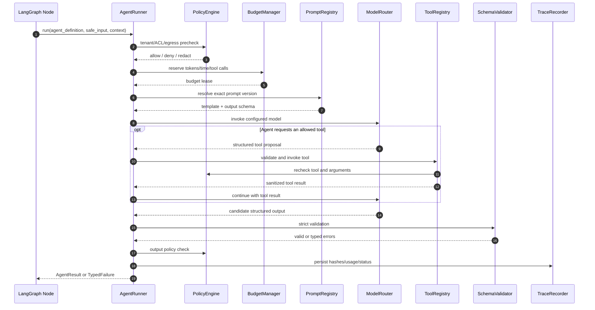

## 8. Graph 通用规范

### 8.1 GraphContext

所有 Graph 使用不可由客户端伪造的运行上下文：

```text
run_id, graph_name, graph_version,
tenant_id, actor_id, department_id, role_ids,
authz_version, request_id/job_id,
started_at, deadline_at, provider_mode,
trace_id, prompt_versions, policy_snapshot_id
```

### 8.2 Checkpoint 与恢复

短问答也写关键 checkpoint；长文档、FAQ 和缺口图在每个外部调用及人工中断前后写 PostgreSQL。Checkpoint 只保存恢复所需状态；大文件和完整解析产物存对象存储，state 保存引用和 hash。

恢复时验证 graph_version、tenant、当前权限和外部任务状态。旧 checkpoint 不能覆盖已经激活的新文档版本或已发布的新 FAQ。每个 node 使用 attempt_id 和 idempotency_key。

### 8.3 Graph 与 Celery

Celery task 负责领取 `graph_run_id` 并调用 Graph Runtime，不把全部流程写成 Celery chain。Graph 决定业务路径，Celery 决定队列、并发、延迟重试和 worker 隔离。文档任务使用 `ingestion` 队列；FAQ/缺口使用 `aiops`；指标和清理使用 `maintenance`。

### 8.4 Graph 通用运行状态图

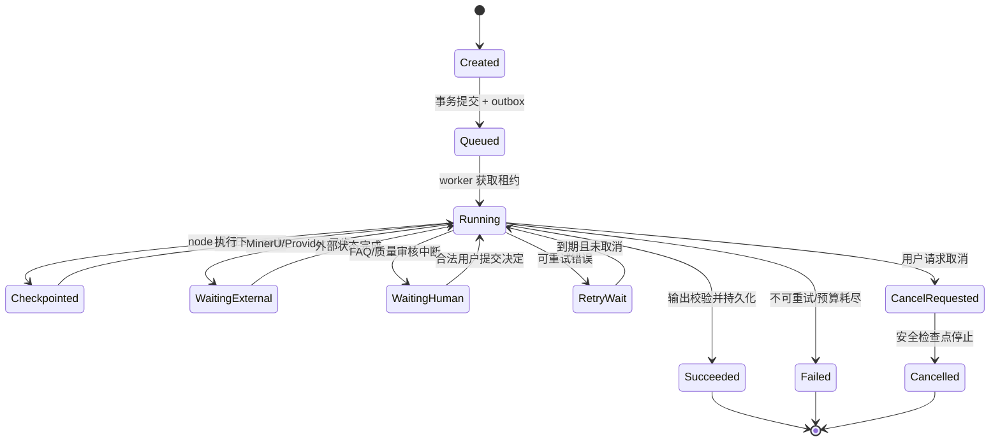

每次从 WaitingExternal、WaitingHuman 或 RetryWait 恢复时，都重新验证 tenant、actor、业务对象版本和权限。Graph 完成状态不能只写 checkpoint，必须同步形成领域终态。

## 9. DocumentIngestionGraph

### 9.1 为什么用 LangGraph

文档导入包含格式分支、异步 MinerU、可选 DOC 转换、LLM 文档分析、不同切片策略、质量复核、失败重试和人工检查。它不是一条固定 ETL；Graph 能显式表达条件路由、checkpoint、重入和低质量分支。

### 9.2 IngestionState

```text
identity:
  tenant_id, actor_id, kb_id, document_id, version_id, batch_id, job_id
file:
  original_object_key, filename, media_type, size, sha256, encrypted
execution:
  graph_version, current_stage, attempt, cancel_requested, deadline_at
provider:
  mineru_job_id, mineru_status, parser_version, provider_mode
artifacts:
  converted_object_key, parsed_object_key, normalized_object_key, artifact_hashes
analysis:
  document_type, language, title, summary, headings, tables, images,
  sensitivity_suggestion, category_suggestion, chunk_strategy, warnings
chunks:
  manifest_object_key, count, chunker_version, token_stats
index:
  embedding_model, dimension, embedded_count, index_version, indexed_count
quality:
  extraction_score, structure_score, chunk_score, citation_score,
  needs_review, reasons
result:
  status, active_version_id, error_code, retryable, timestamps
```

State 中不存整个文件和全部正文。LLM 给出的敏感级别、分类和标题都是建议，不能自动扩大 ACL；默认 ACL 仍为空。

### 9.3 节点与状态变化

| Node | 类型 | 输入 | 主要 State 变化 | 下一步 |
|---|---|---|---|---|
| load_job | 确定性 | job_id | 加载 tenant/文件/版本，锁定执行权 | validate_file |
| validate_file | 确定性 | file metadata | 写 media_type、hash、encrypted、限额结果 | reject / convert / submit_mineru |
| convert_legacy_doc | Tool node | `.doc` 引用 | 写 converted_object_key/hash | submit_mineru |
| submit_mineru | Provider node | 安全文件引用 | 写 mineru_job_id、status | wait_mineru |
| wait_mineru | Provider node | external job id | 更新真实进度和 provider 状态 | retry / fetch_result / fail |
| fetch_result | Provider node | succeeded job | 保存解析产物引用/hash | analyze_document |
| analyze_document | DocumentAnalyzerAgent | 解析结构摘要 | 写文档类型、语言、摘要、章节/表格统计、警告 | extract_metadata |
| extract_metadata | MetadataExtractorAgent | 分析结果和允许样本 | 写标题、分类建议、敏感级别建议 | select_chunk_strategy |
| select_chunk_strategy | ChunkStrategyAgent | 结构与 token 统计 | 写 chunk_strategy 和参数建议 | build_chunks |
| build_chunks | 确定性 Tool node | 解析产物 + 已验证策略 | 写 manifest、count、token_stats | review_quality |
| review_quality | QualityReviewerAgent + 规则 | 结构/切片抽样 | 写各项评分、needs_review、reasons | human_review / embed_chunks |
| human_review | interrupt | 低质量结果 | 等待管理员确认、编辑或驳回 | build_chunks / embed_chunks / fail |
| embed_chunks | Provider node | chunks | 写模型、维度、embedded_count | build_indexes |
| build_indexes | 确定性 | chunks/vectors | 写 index_version、indexed_count | validate_release |
| validate_release | 确定性 | 全部计数/hash | 写一致性结果 | publish_version / compensate |
| publish_version | 确定性事务 | valid version | 原子切换 active_version，写 outbox | complete |
| compensate | 确定性 | failed version | 清理临时索引，保留诊断产物 | retry / failed |

### 9.4 文档分析 Agent

| Agent | 只负责 | 不负责 | 输出 Schema |
|---|---|---|---|
| DocumentAnalyzerAgent | 识别文档类型、主题、章节、表格/图像、异常结构，生成短摘要 | 解析文件、授权、入库 | DocumentAnalysis |
| MetadataExtractorAgent | 提议标题、分类、标签、敏感等级 | 自动设置 global/部门 ACL | MetadataProposal |
| ChunkStrategyAgent | 按制度、FAQ、手册、表格等选择候选切片策略 | 直接写 chunk | ChunkPlan |
| QualityReviewerAgent | 评估 MinerU 结果和切片样本的完整性、可引用性 | 宣称业务事实正确 | QualityReport |

这四个 Agent 默认使用 DeepSeek-V3，输入只能包含当前租户允许外发的数据。若文档不允许发给 SiliconFlow，则跳过 LLM 分析，走确定性默认策略或租户批准的内网模型；页面明确显示 `analysis_skipped_by_policy`。

### 9.5 路由规则

```text
encrypted == true                         → password_required
format == doc and MinerU 不直接支持       → convert_legacy_doc
MinerU running                            → checkpoint + 延迟恢复
extraction_score < 阈值                   → human_review
文档表格密度高                            → table_aware_chunking
文档章节完整                              → heading_aware_chunking
无结构长文本                              → token_window_chunking
计数/hash/维度不一致                      → compensate
全部验证通过                              → publish_version
```

MinerU 输出仍是不可信数据。密码文件不破解；扫描 PDF 低质量进入人工复核；复杂表格重复必要表头并保留页码/单元格定位。

### 9.6 文档导入 Graph 架构图

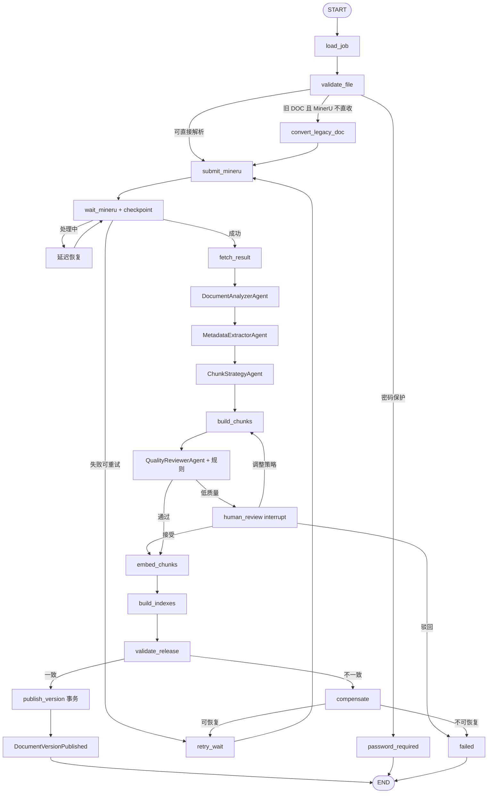

### 9.7 文档导入端到端时序

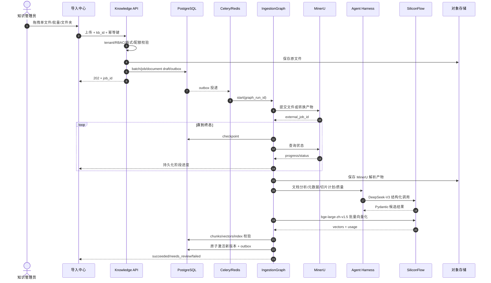

### 9.8 文档 Graph 与其他流程的关系

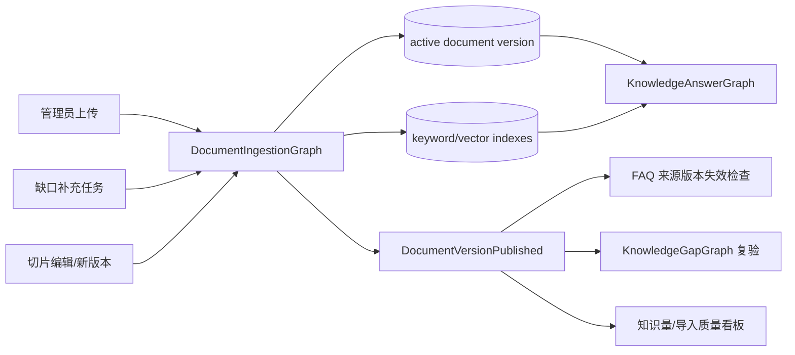

## 10. KnowledgeAnswerGraph

### 10.1 AnswerState

```text
request:
  request_id, conversation_id, tenant_id, user_id, question,
  department_id, role_ids, authz_version, mode
planning:
  rewritten_query, intent, sensitivity, required_sources, selected_mcp_tools
faq:
  hit, faq_id, faq_version, validated
branches:
  local_status, mcp_status, general_status, deadlines, errors
evidence:
  local_evidence[], mcp_evidence[], model_knowledge[]
fusion:
  deduplicated_evidence[], conflicts[], coverage, missing_information
answer:
  draft, claims[], citations[], restricted_notice, warnings
validation:
  schema_valid, citations_valid, policy_valid, current_acl_valid
result:
  status, persisted_message_id, usage, timings
```

未授权本地正文在 ACL node 后立即删除，只保留 restricted_count/flag；任何后续 Agent state 都不包含被拦截正文。

### 10.2 在线多 Agent

| Agent | 输入 | 职责 | 工具 | 输出 |
|---|---|---|---|---|
| QueryPlannerAgent | 当前问题 + 仍授权历史摘要 | 改写问题、识别意图/敏感级别、建议分支 | 无写工具 | QueryPlan |
| LocalRetrievalAgent | QueryPlan + auth context | 调用本地检索工具，解释召回策略 | keyword_search、vector_search、rerank；工具内强制 ACL | LocalEvidenceSet |
| McpResearchAgent | QueryPlan + 工具白名单 | 选择并调用魔搭 MCP 工具，规范化证据 | approved MCP tools | McpEvidenceSet |
| GeneralKnowledgeAgent | 非内部敏感问题 | 生成明确标注的一般知识候选 | Chat model，无业务写工具 | ModelKnowledgeSet |
| EvidenceFusionAgent | 三路已清洗证据 | 去重、主题对齐、发现冲突与缺口 | 无外部工具 | FusionReport |
| AnswerWriterAgent | FusionReport + 证据白名单 | 按证据生成 Markdown 和 claims | Chat model | StructuredAnswerDraft |

CitationVerifier、PolicyGuard、ACLRevalidator 是确定性 node，不称为 Agent。它们负责验证引用 ID、内部结论证据、受限提示、输出安全和流发送前的当前权限。

### 10.3 Graph 路径

```text
START → authorize_request → load_authorized_history → plan_query
      → validate_faq_cache
          ├─ valid hit → build_cached_answer → revalidate → persist → stream → END
          └─ miss
               → fan_out
                  ├─ local_retrieval_agent
                  ├─ mcp_research_agent
                  └─ general_knowledge_agent（按策略启用）
               → join_with_deadline
               → normalize_evidence
               → evidence_fusion_agent
               → route_by_coverage
                  ├─ denied/no_evidence → safe_response
                  ├─ conflict → answer_with_conflict
                  └─ sufficient → answer_writer_agent
               → validate_schema
               → verify_claim_citations
               → policy_guard
               → revalidate_acl
               → persist_answer_and_audit
               → stream_final_events → END
```

三路不是简单拼接字符串。fan-out 后统一转成 Evidence Schema；join 等到截止时间而不是无限等待；每个分支保留 success/timeout/denied/error。部分成功可生成 `partial` 回答，全部失败返回明确错误。

### 10.4 三路业务规则

- 企业制度、薪资、金额、权限、合同、审批只能依赖授权本地证据或租户批准的权威 MCP 证据。
- LLM 自有知识只用于一般说明，标记“模型一般知识”，不能填补受限内容。
- 本地与 MCP 冲突时展示冲突、来源和时间；企业内部操作以当前有效内部制度为准。
- 同级内部文档冲突时创建治理任务，Agent 不自行选择一个事实。
- MCP 分支由 Tool Registry 白名单控制；模型不能构造任意 URL。
- 最终 claim 的 evidence_ids 必须来自本次证据白名单，下载地址由服务端生成。

### 10.5 在线问答 Graph 图

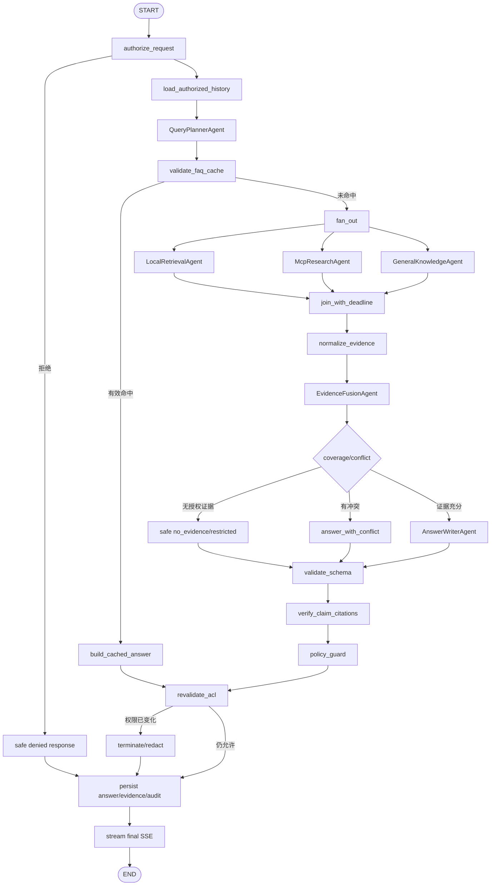

### 10.6 多 Agent 并行协作时序

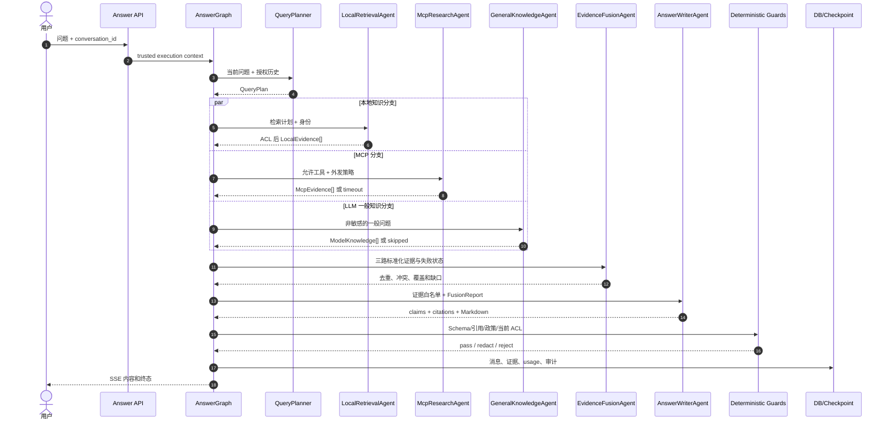

### 10.7 问答分支失败决策图

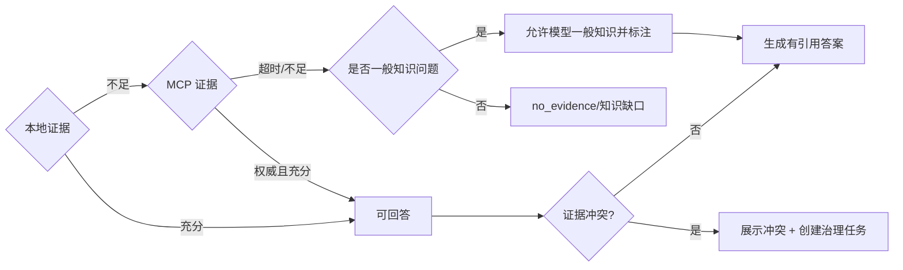

## 11. FaqEvolutionGraph

### 11.1 FaqState

```text
tenant_id, window_start, window_end,
eligible_question_ids, normalized_questions,
clusters, selected_cluster,
source_evidence, candidate_question, candidate_answer,
candidate_acl, confidence_details,
submission_id, review_decision, reviewer_id,
faq_id, faq_version, cache_status, errors
```

### 11.2 节点

```text
load_eligible_logs（确定性，默认 7 日）
 → normalize_and_deduplicate（规则 + Embedding）
 → cluster_questions（算法）
 → ClusterAnalystAgent（解释主题、排除错误合并）
 → threshold_gate（默认 10 次且 5 个独立用户）
 → retrieve_current_sources（当前 ACL）
 → FaqDrafterAgent（候选问答）
 → validate_candidate（Schema、来源、可见范围）
 → persist_draft
 → interrupt_for_human_review
     ├─ reject → persist_rejection → END
     ├─ edit/resubmit → validate_candidate
     └─ approve → deterministic_publish
 → cache_sync → verify_cache → END
```

人工审核节点保存提交人、审核人、修改内容、决定、理由和时间。Agent 不批准自己的候选。发布事务确认 `faq.publish` 权限、状态版本和来源 ACL；FAQ 可见范围不得大于所有依赖来源可见范围的交集。

### 11.3 FAQ 运营闭环图

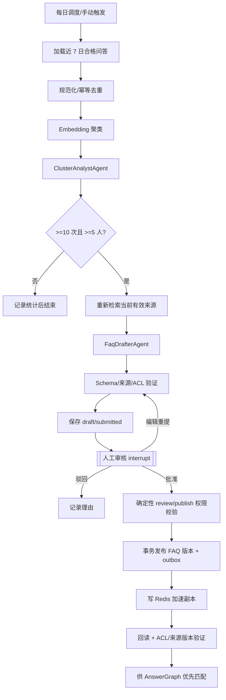

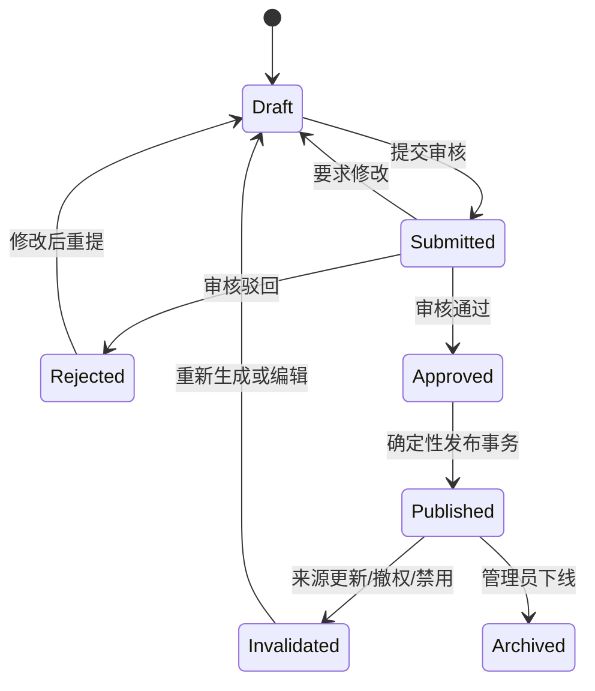

## 12. KnowledgeGapGraph

```text
collect_answer_failures
 → classify_reason（规则先判 provider_error/access_denied）
 → GapDiagnoserAgent（分析 no_match/low_relevance/insufficient/conflict）
 → aggregate_similar_gaps
 → TaskSuggestionAgent（建议分类、负责人类型、补充方向）
 → persist_gap
 → interrupt_for_admin_assignment
 → link_ingestion_graph_run
 → wait_document_published
 → replay_original_case_with_test_identity
 → validate_replay
     ├─ success + human confirm → close_gap
     └─ fail → reopen_with_reason
```

`access_denied` 不进入知识缺口；`provider_error` 进入系统告警。复验调用真实的 AnswerGraph，不用 Agent 自报“已经解决”。

### 12.1 知识缺口跨 Graph 工作流

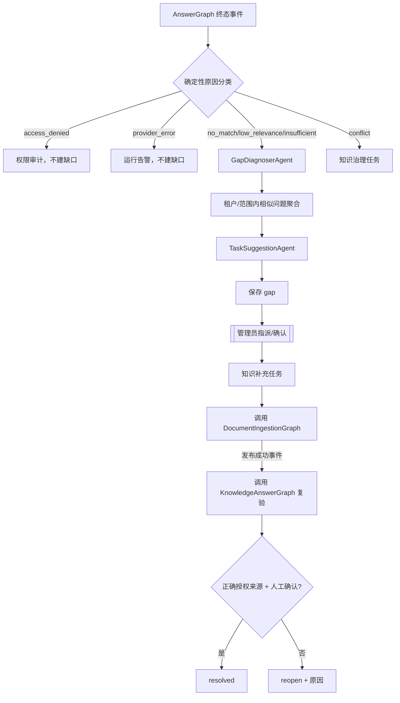

### 12.2 缺口复验时序

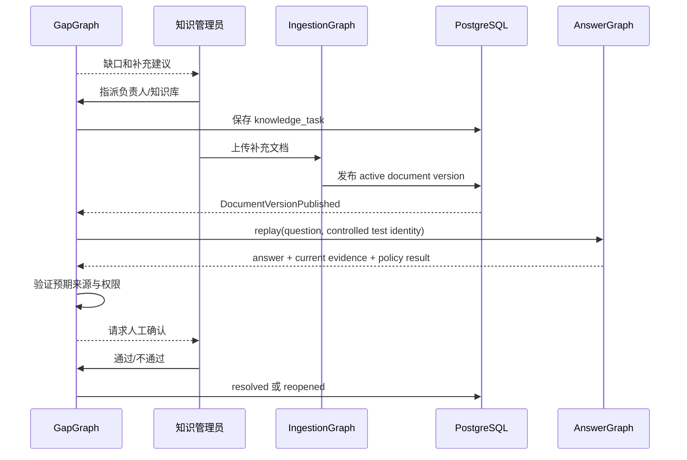

## 13. 非 Agent 业务模块

### 13.1 Tenant/Organization/RBAC/ACL

使用领域服务、数据库约束和策略引擎。共享 schema 所有业务表带 tenant_id，并用 Repository tenant scope + PostgreSQL RLS 双重隔离。部门闭包表支持“授权父部门覆盖下级”；用户在租户内只有一个 department_id。

权限读取条件：认证有效、同租户、功能权限满足、对象有效，并满足 global / 部门祖先匹配 / 角色交集 / 用户 ID 任一条件。创建人和管理员不是隐式第五权限。

### 13.2 PersonnelChangeSaga

离职/调岗采用确定性 Saga：身份变更 → token 撤销 → authz_version 增加 → 职责清单 → 管理员选择个人知识处置 → 批量转移 → 校验 → 完成。失败可重试，不能恢复已禁用账号。该流程不需要 LLM。

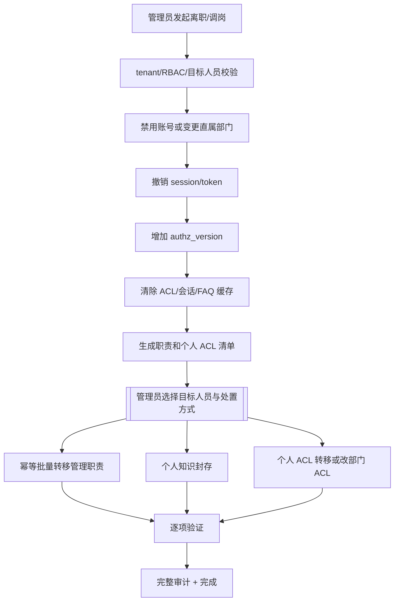

### 13.3 Analytics

PV/UV、Token、耗时、FAQ 命中率和榜单通过事件和 SQL 聚合计算。LLM 不计算正式指标。业务日志保留 7 日；安全审计期限独立配置。

## 14. RAG 与证据层

### 14.1 本地多路召回

本地路内部仍是多路：FAQ 精确/语义缓存 → 中文关键词 → 向量 → RRF → ACL 最终过滤 → Rerank → Context Builder。不同检索器分数不直接相加。过滤后候选不足时扩大召回到上限。

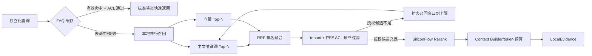

### 14.2 Evidence Schema

```text
evidence_id, source_type(local|mcp|model_knowledge),
tenant_id, title, sanitized_content,
authority(internal_policy|external_authority|external_reference|general),
locator(document/version/chunk/page 或 mcp server/tool/resource),
observed_at, version, acl_snapshot, quality_flags
```

State 内包含 tenant_id 供服务端校验，但对前端只输出必要字段。`model_knowledge` 没有伪造 locator，不允许作为内部制度 claim 的唯一证据。

### 14.3 MCP Gateway

魔搭服务若原生支持 MCP，使用标准 MCP Client；若只是 HTTP API，建设独立 `modelscope_wrapper` MCP Server。Registry 为每租户保存 server/tool 白名单、JSON Schema、可外发数据等级、角色、超时和日限额。

调用链：McpResearchAgent 提案 → PolicyEngine 验证 → MCP Gateway 执行 → 响应大小/Schema/脚本清理 → Evidence Normalizer。禁止提供任意 HTTP 工具，防止 SSRF 和工具注入。

### 14.4 Milvus 向量数据面

PostgreSQL 保存文档、版本、chunk 正文、tenant、ACL、Embedding 任务和索引发布状态；Milvus 只保存向量以及完成候选定位所需的标量字段。Milvus 不是权限事实源，也不能替代 PostgreSQL RLS。

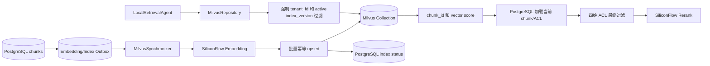

Collection 以 Embedding 模型和索引版本为边界，不为每个小租户创建一套 collection，避免 collection 数量膨胀。首期建议字段为 `chunk_id`、`tenant_id`、`kb_id`、`document_id`、`version_id`、`index_version`、`embedding`、`created_at`。正文和完整 ACL 不以 Milvus 为权威存储。

所有查询必须走 `MilvusRepository.search(tenant_context, ...)`，由 Repository 注入 `tenant_id` 和 active index_version 表达式；禁止业务层接触原始 Milvus Client 并自由编写 filter。向量候选返回后，再从 PostgreSQL 加载当前文档状态和 ACL 做最终鉴权。

写入以固定小批次执行，保存批次号、总数和累计成功数。`chunk_id + index_version` 构成幂等业务键；中途失败只重试失败批次，不能先把全部文档一次性编码完才写入。同步完成后对账 PostgreSQL active chunks 与 Milvus entities，缺失项补写，孤儿项延迟清理。

索引从 Milvus 的 HNSW 或适合实际规模的 ANN 类型中通过评测选择，距离度量与 Embedding 输出保持一致。索引参数、collection schema、模型维度和 metric 写入版本清单；未经评测不能把参数写成固定性能承诺。

模型或切片策略升级时创建新 collection/index version 或新 alias 指向，后台构建、评测后原子切换 alias。旧版本保留观察期，禁止直接 drop 当前 collection。跨租户隔离测试必须覆盖缺失 tenant filter、伪造 chunk_id、缓存命中和异常回退。

## 15. Provider 与模型网关

### 15.1 配置

```text
CHAT_PROVIDER=siliconflow
CHAT_MODEL=deepseek-ai/DeepSeek-V3
EMBEDDING_PROVIDER=siliconflow
EMBEDDING_MODEL=BAAI/bge-large-zh-v1.5
RERANK_PROVIDER=siliconflow
RERANK_MODEL=Pro/BAAI/bge-reranker-v2-m3
PARSER_PROVIDER=mineru
MCP_PROVIDER=modelscope
```

API Key 只放云 Secret Manager 或受保护环境，文档和 UI 不显示明文。每次调用保存 provider、model、mode、prompt/schema version、request/job、耗时、usage、外部任务 ID、attempt 和结构化错误。

### 15.2 错误与降级

| 依赖 | 错误 | 行为 |
|---|---|---|
| MinerU | 429/5xx/超时 | 有限退避并 checkpoint；旧文档版本继续服务 |
| MinerU | 密码/格式不支持 | 不重试，进入明确终态或人工处理 |
| Embedding | 部分失败 | 只补失败 batch，不激活半成品索引 |
| Rerank | 超时 | 使用 ACL 后的 RRF 排名，标记 skipped |
| MCP | 超时/限额 | 本地证据足够则 partial；否则提示当前无法确认外部信息 |
| Chat | 首 token/总时长超时 | 返回已验证证据列表和失败状态，不生成假答案 |
| Agent Schema | 校验失败 | 最多有限修复；仍失败进入 failed，不持久化为完整答案 |

## 16. 数据模型

在租户、组织、知识、ACL、会话、FAQ、缺口、指标和审计等业务实体之外，AI 编排层还需要以下实体：

| 表 | 作用 | 关键字段 |
|---|---|---|
| graph_runs | Graph 实例 | tenant_id、graph_name/version、business_key、status、checkpoint_id |
| graph_node_runs | Node 轨迹 | node_name/version、attempt、input/output hash、status、timing |
| agent_runs | Agent 轨迹 | agent_name/version、prompt_version、model_call_id、schema_status |
| graph_checkpoints | 可恢复状态 | run_id、sequence、state_ref/encrypted_payload、created_at |
| tool_calls | 本地/MCP 工具调用 | tool_name/version、args hash、result hash、policy decision |
| model_calls | 模型调用 | provider/model/mode、usage、latency、error category |
| prompt_versions | Prompt 注册 | agent、version、content hash、status、approved_by |
| eval_runs | 评测批次 | dataset_version、graph_version、model config、metrics |
| architecture_baselines | 架构基线 | version、document hash、approval reference、created_at |

Graph checkpoint 大正文使用对象存储引用并加密；数据库保存 hash。业务结果仍写领域表，不能只存在 LangGraph checkpoint 中。

## 17. API 与事件

REST 实现需求规格 v1.1 的全部业务接口，并增加以下 Graph 可观测接口：

| API | 作用 | 权限 |
|---|---|---|
| GET /api/v1/graph-runs/{id} | 查询当前节点、进度和终态 | 业务对象访问权限 |
| POST /api/v1/graph-runs/{id}/cancel | 申请取消 | 对应操作权限和归属 |
| POST /api/v1/graph-runs/{id}/resume | 人工节点提交决定 | 指定 review 权限 + expected checkpoint |
| GET /api/v1/answer-requests/{id}/trace-summary | 用户可见的分支状态摘要 | 会话归属，不返回内部 Prompt/受限正文 |
| GET /api/v1/admin/agent-runs/{id} | 受控 Agent 诊断 | AI 运维权限，正文脱敏 |

领域事件：DocumentImportRequested、DocumentVersionPublished、DocumentAclChanged、AnswerCompleted、FaqCandidateSubmitted、FaqPublished、KnowledgeGapCreated、PersonnelChanged。Outbox 与业务事务同提交，消费者按 event_id 去重。

SSE 事件包括 accepted、graph_node、branch_status、retrieval_status、mcp_status、generation_started、delta、citation、warning、restriction_notice、done、error。前端显示的是可公开阶段，不暴露内部 chain-of-thought、Prompt 或受限候选。

### 17.1 前端、API、Graph 与持久化的统一请求链

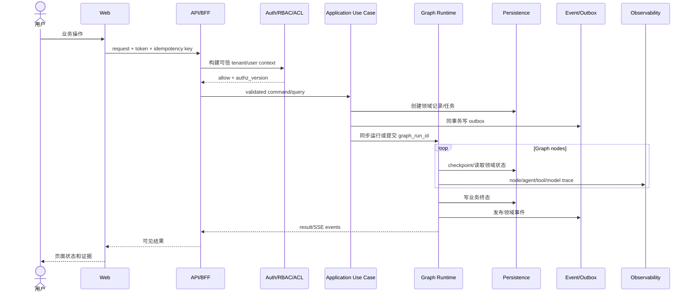

## 18. 安全与治理

### 18.1 Agent 安全边界

- Agent 不能获得数据库连接、Secret 或任意 HTTP 工具。
- Tool 层从 ExecutionContext 读取 tenant/user，不接受 Agent 传入 tenant_id 覆盖。
- 文档和 MCP 返回中的指令只作为数据。
- 每次 Tool/Model 调用前后执行 PolicyEngine。
- 最大 Graph 步数、Agent 调用数、工具次数、token、耗时和费用均有限额。
- 禁止 Agent 直接执行 ACL 修改、FAQ 发布、用户变更和正式指标写入。

### 18.2 数据外发

MinerU 会接收文件，Embedding 会接收切片，Rerank 会接收问题和候选，Chat 会接收分析内容，MCP 会接收工具参数。`egress_policy` 对每个 tenant、数据分类和 provider 分别授权；禁止只控制最终 Chat。

如果资料不允许发给云模型：文档 Graph 跳过云 LLM 分析或路由到批准的内网模型；本地检索可继续；MCP 分支关闭。真实企业资料接入前必须完成外发批准。

### 18.3 权限与缓存

ACL 更新事务同时写 outbox，失效问答缓存、FAQ、引用、Graph 活跃状态和历史来源。流式发送前重新校验 authz_version 与 source acl_version。跨租户对象统一隐藏存在性。

## 19. Prompt 与 Schema 管理

Prompt 按 Agent 独立文件和版本维护，例如：

```text
packages/agent_harness/src/prompts/
├─ document_analyzer/v1.yaml
├─ metadata_extractor/v1.yaml
├─ chunk_strategy/v1.yaml
├─ quality_reviewer/v1.yaml
├─ query_planner/v1.yaml
├─ evidence_fusion/v1.yaml
├─ answer_writer/v1.yaml
├─ cluster_analyst/v1.yaml
├─ faq_drafter/v1.yaml
└─ gap_diagnoser/v1.yaml
```

Prompt 文件包括用途、输入 Schema、输出 Schema、允许工具、禁止行为、示例和版本。变更必须跑回归 Eval，不能在 node.py 中临时拼接不可追踪的系统提示。

每个 Agent 输出 Pydantic Schema；修复失败不能把原始文本直接当结构化结果。权限结果、受限提示和写入状态不从模型输出字段决定。

## 20. AI 评测体系

### 20.1 数据集

- ingestion_eval：五格式、扫描件、表格、章节、低质量、密码文件。
- retrieval_eval：两租户、部门父子、角色、个人、global、空 ACL、调岗。
- answer_eval：内部事实、公共知识、MCP 实时信息、冲突、无证据和多轮。
- faq_eval：同义问题、数字/否定差异、刷频、跨权限问题。
- security_eval：跨租户 IDOR、Prompt 注入、MCP tool 注入、引用伪造、历史撤权。

### 20.2 指标

文档：字段/标题层级准确率、表格保持率、引用定位成功率、低质量检出率。检索：授权 Recall@5、MRR、无权限泄漏数。回答：引用正确率、claim 支持率、拒答正确率、冲突检出率。Agent：Schema 成功率、平均步骤、工具失败率、token/费用、超时率。FAQ：聚类纯度、候选采用率、缓存准确率。缺口：分类正确率、复验关闭正确率。

所有 Eval 固定 dataset_version、graph_version、prompt_version、model 和索引版本。开发集与最终验收集分开。

## 21. 可观测性

一条 trace 贯穿：HTTP → Graph → Node → Agent → Tool → Provider → DB/Cache。记录状态、耗时、usage、错误和输入输出 hash；默认不记录正文和 chain-of-thought。

核心看板：Graph 成功/失败/中断、各 node P95、MinerU 等待时长、Embedding batch 失败、三路分支成功率、MCP 工具错误、Chat 首 token、Schema 修复率、ACL 拒绝、缓存失效滞后、token 和估算费用。

业务运行日志保留 7 日。Graph/Agent 业务明细遵守同一策略；安全审计期限独立配置。领域数据、对话、文档和 checkpoint 的保留按业务生命周期管理，不能把“日志 7 日”误解为 7 日后删除知识文档。

## 22. 云部署拓扑

```text
Internet/Intranet Users
        │
   WAF / HTTPS LB
        │
 ┌──────┴──────────────┐
 │ Web/API replicas    │
 │ Agent Runtime pods  │
 └──────┬──────────────┘
        │ private network
 ┌──────┼────────────────────────────────────────┐
 │ PostgreSQL │ Milvus │ Redis │ Object Storage  │
 └──────┼────────────────────────────────────────┘
        │
 ┌──────┴────────────────────────────────────────┐
 │ ingestion workers │ aiops workers │ scheduler │
 └──────┬────────────────────────────────────────┘
        │ controlled egress
 MinerU │ SiliconFlow │ ModelScope/MCP
```

环境分 dev、test、staging、pilot，各自独立 PostgreSQL、Milvus collection/database、bucket、Redis、Secret 和 provider 配额。真实数据只进入获准 pilot。目标为阿里云 ECS，沿用电商运营助手的 Docker Compose、Nginx、容器化依赖和管理脚本模式。

项目根目录已确认为 `/root/myproject`，建议仓库目录 `/root/myproject/AI_Knowledge_Base`，实施前通过服务器只读检查确认。Git 远端记录为 `https://github.com/feihu0608/AI_Knowledge_Base.git`，本次没有连接或克隆。

电商运营助手环境文档记录的服务器规格为 2 核 4 GiB。该规格可继续承载轻量 Web/API/PostgreSQL/Redis/单 Worker 演示，但不建议同时承载完整 Milvus Standalone 及其依赖。首选准备方案是把 Milvus 放到独立 ECS 或经确认的托管 Milvus 服务；若坚持同机自建，必须先做资源评估和持久化设计，再决定是否升级 ECS。不能在 2 核 4 GiB 上未经压测承诺稳定运行。

### 22.1 云部署组件图

```mermaid
flowchart TB
    subgraph Public[接入区]
        DNS[DNS/证书]
        WAF[WAF/负载均衡]
        WEB[Web 静态站点]
    end

    subgraph AppNet[应用私网]
        API1[API Replica 1]
        API2[API Replica 2]
        AR1[Agent Runtime 1]
        AR2[Agent Runtime 2]
        WI[Ingestion Workers]
        WA[AI Ops Workers]
        SCH[Scheduler]
    end

    subgraph DataNet[数据私网]
        PG[(Managed PostgreSQL)]
        MV[(Milvus Vector Store)]
        REDIS[(Managed Redis)]
        OBJ[(Private Object Storage)]
        SECRET[Secret Manager]
    end

    subgraph External[受控外部服务]
        MU[MinerU]
        SF[SiliconFlow]
        MS[ModelScope/MCP]
    end

    DNS --> WAF --> WEB
    WAF --> API1
    WAF --> API2
    API1 --> AR1
    API2 --> AR2
    API1 --> PG
    API2 --> PG
    AR1 --> PG
    AR2 --> PG
    AR1 --> MV
    AR2 --> MV
    WI --> MV
    WI --> PG
    WA --> PG
    SCH --> REDIS
    WI --> REDIS
    WA --> REDIS
    API1 --> OBJ
    WI --> OBJ
    API1 --> SECRET
    AR1 --> SECRET
    WI --> SECRET
    WI --> MU
    WI --> SF
    AR1 --> SF
    AR1 --> MS
```

### 22.2 故障恢复关系图

```mermaid
flowchart TD
    FAIL{故障类型} --> APIERR[API 实例故障]
    FAIL --> WORKERERR[Worker/Graph 中断]
    FAIL --> PROVIDERERR[外部 Provider 故障]
    FAIL --> REDISERR[Redis 故障]
    FAIL --> DBERR[数据库故障]

    APIERR --> LB[负载均衡转发其他副本]
    WORKERERR --> LEASE[租约超时 + checkpoint 恢复]
    PROVIDERERR --> CLASS[结构化错误/有限重试/分支降级]
    REDISERR --> BYPASS[FAQ/权限回数据库，暂停新异步任务]
    DBERR --> RO[停止写入 + 恢复快照/PITR]

    LEASE --> RECON[Reconciliation 对账]
    CLASS --> RECON
    BYPASS --> RECON
    RO --> VERIFY[tenant/ACL/hash/checkpoint 验证]
    VERIFY --> RECON
    RECON --> OPEN[受控恢复流量]
```

## 23. 备份、恢复和升级

- PostgreSQL 每日快照并按目标配置时间点恢复；对象存储开启版本。
- Milvus 自建时同时备份其对象数据和元数据依赖，并保存 collection schema、index params、alias 和 embedding/index version 清单；托管形态使用服务提供的备份策略。
- 向量可由 PostgreSQL chunks 和确定的 Embedding 配置重建，但恢复时间与模型费用必须纳入 RTO 和预算。
- Redis 可重建；Graph checkpoint 和任务状态必须在 PostgreSQL。
- 恢复后先验证 tenant/RLS/ACL、文档 hash、checkpoint 与 active_version，再开放 worker。
- LangGraph graph_version 变化时提供 state migration；在运行中的旧图由兼容 runtime 完成或受控迁移。
- Prompt、Schema、AgentDefinition、Graph 和索引均有独立版本，回滚时作为配置组合回滚。
- 向量模型变更创建新 index_version，评测后原子切换，旧索引保留观察期。

## 24. 需求到模块、Graph 和测试追踪

| 原业务需求 | 实现模块/Graph | 关键测试 |
|---|---|---|
| 组织、角色、用户、按钮权限 | domain.organization/rbac + application use case | 多租户、部门闭包、禁用、按钮 API 越权 |
| 五格式导入、清洗、切片、向量化 | DocumentIngestionGraph + MinerU/Embedding + MilvusSynchronizer | 五格式 live、低质量、批量幂等同步、对账、原子发布 |
| 四维 OR 权限、默认拒绝 | domain.authorization + retrieval.acl_filter | 真值表、父部门覆盖、跨租户、所有读取入口 |
| 混合检索 | retrieval keyword/vector/RRF/rerank | 授权 Recall@K、过滤后补召回 |
| 本地 + MCP + LLM 三路 | KnowledgeAnswerGraph + 六个 Agent | 并行、部分失败、冲突、无证据、来源标签 |
| 多轮、SSE、引用 | conversations + AnswerGraph streaming | 断线恢复、幂等、撤权后历史/引用 |
| FAQ 聚类和审批缓存 | FaqEvolutionGraph + human interrupt | 真实日志上游、审批状态、来源 ACL、失效 |
| 知识缺口闭环 | KnowledgeGapGraph + Ingestion/Answer 子图 | 缺口分类、建任务、补文档、原身份复验 |
| 看板和审计 | analytics/audit | SQL 对账、7 日清理、权限脱敏 |
| 人员权限转移 | PersonnelChangeSaga | 离职、调岗、任务和个人 ACL 处置 |

没有业务需求被 Agent 化后删除。Graph 是实现同一需求的编排方式，不改变验收结果。

## 25. 分阶段实现

| 阶段 | 内容 | 完成证据 |
|---|---|---|
| M0 | Monorepo、配置、迁移、Harness 骨架、Graph Runtime、两租户数据 | 分层导入规则、架构守卫、干净启动 |
| M1 | Tenant/Org/RBAC/ACL、部门闭包、Personnel Saga | 跨租户和四维权限全入口测试 |
| M2 | DocumentIngestionGraph 到 MinerU 解析和版本发布 | 五格式、LLM 分析、质量人工中断、可检索结果 |
| M3 | 本地 RAG 和 AnswerGraph | Embedding/Rerank/Chat live、引用和 SSE |
| M4 | McpResearchAgent 与三路融合 | 魔搭工具 live、冲突/超时/一般知识标签 |
| M5 | FaqEvolutionGraph 人工审核发布 | 候选、审核、缓存、撤权失效完整链路 |
| M6 | KnowledgeGapGraph 和看板 | 缺口补文档复验、指标对账 |
| M7 | 云部署、安全、压测、恢复、Eval | pilot 环境浏览器证据和恢复演练 |

## 26. 架构守卫

实施仓库必须提供自动检查：

1. 禁止 domain 导入 FastAPI、LangGraph、Celery 和 Provider SDK。
2. 禁止 Graph node 直接创建供应商客户端。
3. 禁止 AgentDefinition 注册未在 Tool Registry 的工具。
4. 禁止 Provider 密钥出现在源码、配置样例和日志。
5. 检查所有业务 ORM 表含 tenant_id 或明确标记为平台公共表。
6. 检查所有 Graph 具有 state.py、graph.py、routes.py、节点测试和 graph_version。
7. 检查所有 Agent 具有 Definition、Prompt version、输入/输出 Schema、tool allowlist 和预算。
8. 检查 Requirement → Component → Test 矩阵没有孤立需求。
9. 检查本架构文档 SHA-256 与批准基线一致；架构变更必须先记录 ACP。

当前目录只有分析文档，没有实现仓库，因此本次只能完成文档结构和 SHA-256 校验，不能声称代码架构守卫已经运行通过。

## 27. 架构决策记录

| ADR | 决策 | 业务理由 |
|---|---|---|
| ADR-010 | 四个独立 LangGraph，不做一个万能大图 | 文档、问答、FAQ、缺口生命周期不同，可独立测试和扩缩 |
| ADR-011 | 文档导入也使用 LangGraph | 包含 MinerU 异步、LLM 分析、策略分支、质量人工复核和恢复 |
| ADR-012 | Celery 承载 Graph，不替代 Graph | 分离可靠调度与业务状态编排 |
| ADR-013 | Agent Harness 统一运行 Agent | 统一权限、工具、预算、Schema、Prompt 和追踪 |
| ADR-014 | 在线问答六个专职 Agent | 三路并行与证据融合需要独立职责，避免单 Agent 权限过大 |
| ADR-015 | 硬权限与写入不交给 Agent | 防止随机输出影响安全和状态一致性 |
| ADR-016 | Graph state 与领域数据分离 | checkpoint 用于恢复，业务表才是用户可见事实 |
| ADR-017 | 模块化 Monorepo、多进程部署 | 保证代码结构化并减少试点初期微服务网络复杂度 |
| ADR-018 | PostgreSQL 事实源 + Milvus 向量数据面 | 用户明确指定 Milvus；领域和权限事实仍由 PostgreSQL 管理 |
| ADR-019 | 阿里云 ECS 沿用电商助手容器模式 | 用户明确指定相同环境；Milvus 资源必须单独评估 |

## 28. 待确认但不阻止虚构数据开发的输入

已确认未来在阿里云上线、项目根目录 `/root/myproject`、GitHub 仓库和 Milvus。仍需确认阿里云地域和 ECS 实际规格、仓库最终检出目录、Deploy Key、Milvus 自建/独立/托管形态、并发、文档量、MinerU 具体端点、魔搭具体 MCP 工具、数据是否允许发送到三方、硅基流动预算和限流、SSO、RPO/RTO、安全审计期限。

这些项目会影响部署和真实数据准入，但不会改变本版本的业务功能、Graph 边界和模块职责。任何后续材料不得为了适配不完整代码而静默删改本架构；需要变更时先提交架构变更提案并获得用户确认。

## 29. 阅读顺序

第一次阅读建议按“4.2 总体业务闭环 → 4.4 完整生命周期 → 9 文档图 → 10 问答图 → 11 FAQ 图 → 12 缺口图 → 24 需求追踪”阅读。开发人员再继续阅读目录结构、Harness、State、Provider、安全和部署章节。

图中每一条跨模块箭头都必须在实现中对应 API、领域事件、Tool port 或 Repository port，禁止通过读取其他模块内部表或导入内部实现形成隐式耦合。
